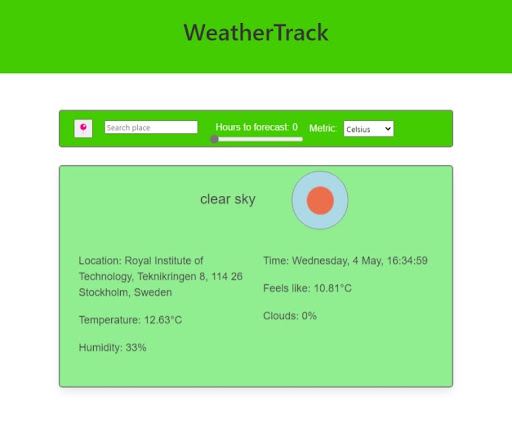

# WeatherThing

WeatherThing is a weather app intended to provide current and hourly forecast weather data. The app uses the [openWeather](https://openweathermap.org/) and [Geoapify](https://www.geoapify.com/) API to get the weather based on location and user preference on metrics. 

